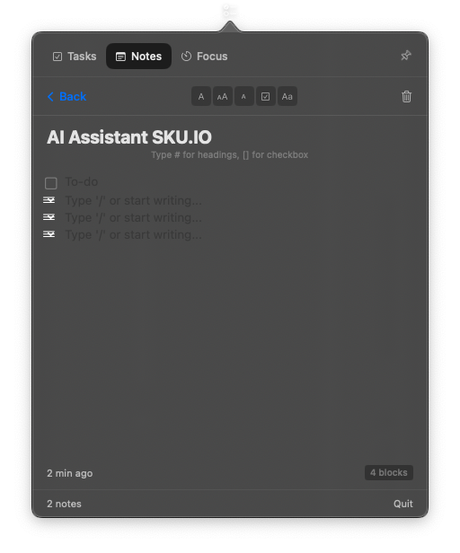

# StickyTasks

A minimal, Notion-inspired menu bar app for macOS. Tasks, notes with live markdown, and a focus timer — always one click away.



## Features

- **Menu Bar App** — Lives in your Mac menu bar, no dock icon clutter
- **Tasks** — Quick add, check off, clear completed
- **Notes with Live Markdown** — Type `#` for headings, `[]` for checkboxes. Syntax converts instantly — no raw markdown visible
- **Block Editor** — Each line is a styled block (H1, H2, H3, checkbox, text). Change type via hover menu or toolbar
- **Focus Timer** — Start/stop timer to track deep work sessions. See today's total focus time
- **Pin Mode** — Pin the popover so it stays visible while you work
- **Persistent Storage** — Everything saved locally to `~/Library/Application Support/StickyTasks/`

## Requirements

- macOS 14.0+
- Swift 5.9+

## Build & Run

```bash
cd StickyTasks
swift build
.build/debug/StickyTasks &
```

## Usage

- Click the checklist icon in the menu bar to open
- **Tasks tab**: Type and press Enter to add. Click circle to complete. Hover for delete.
- **Notes tab**: Create notes with live markdown rendering. Type `# ` for H1, `## ` for H2, `### ` for H3, `[] ` for checkbox.
- **Focus tab**: Hit Start to begin a focus session. Stop when done. View today's sessions.
- **Pin button** (top-right): Keep the popover visible — it won't dismiss when you click elsewhere.

## License

MIT
